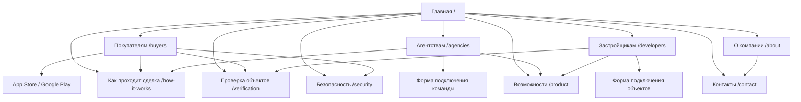

# Архитектура сайта «БАСТ Недвижимость»

Версия: 1.0

Дата: 19 июня 2026 года

## 1. Архитектурное решение

Один домен, одна бренд-система и отдельные страницы для трёх аудиторий:

- покупателей;
- риэлторов и агентств;
- застройщиков и продавцов.

Главная страница работает как короткое объяснение продукта и маршрутизатор. Она не повторяет содержимое всех профильных страниц.

## 2. Иерархия страниц

```text
Главная (/)
├── Покупателям (/buyers)
├── Риэлторам и агентствам (/agencies)
├── Застройщикам (/developers)
├── Возможности платформы (/product)
├── Как проходит сделка (/how-it-works)
├── Проверка объектов (/verification)
├── Безопасность данных (/security)
├── Кейсы (/case-studies)
│   └── Страница кейса (/case-studies/{slug})
├── О компании (/about)
├── Контакты (/contact)
├── Политика конфиденциальности (/privacy)
└── Пользовательское соглашение (/terms)
```

`/case-studies` запускается после появления материалов, разрешённых к публикации. До этого ссылка не показывается в основной навигации.

## 3. Визуальная карта



## 4. Карта URL

| Страница | URL | Родитель | Навигация | Приоритет | Основное действие |
|---|---|---|---|---|---|
| Главная | `/` | — | Логотип | Критический | Скачать приложение |
| Покупателям | `/buyers` | Главная | Header | Критический | App Store / Google Play |
| Агентствам | `/agencies` | Главная | Header | Высокий | Подключить команду |
| Застройщикам | `/developers` | Главная | Header | Высокий | Подключить объекты |
| Возможности | `/product` | Главная | Header | Средний | Выбрать роль |
| Как проходит сделка | `/how-it-works` | Главная | Header | Высокий | Открыть приложение |
| Проверка объектов | `/verification` | Главная | Контекстная ссылка / Footer | Высокий | Открыть приложение |
| Безопасность | `/security` | Главная | Footer | Средний | Изучить обработку данных |
| Кейсы | `/case-studies` | Главная | Header после наполнения | Средний | Открыть кейс |
| О компании | `/about` | Главная | Header | Средний | Связаться |
| Контакты | `/contact` | Главная | Footer | Средний | Написать или позвонить |
| Политика конфиденциальности | `/privacy` | Главная | Footer | Обязательный | — |
| Пользовательское соглашение | `/terms` | Главная | Footer | Обязательный | — |

## 5. Навигация

### 5.1. Header

Порядок пунктов:

1. Покупателям.
2. Агентствам.
3. Застройщикам.
4. Как работает.
5. О «БАСТ».
6. Кнопка «Скачать приложение».

На desktop кнопка открывает компактную развилку:

- App Store;
- Google Play;
- QR-код.

На мобильном устройстве кнопка ведёт в подходящий магазин или показывает две ссылки, если система не определена.

### 5.2. Footer

**Пользователям**

- Покупателям.
- Как проходит сделка.
- Проверка объектов.
- Безопасность.

**Партнёрам**

- Агентствам.
- Застройщикам.
- Возможности платформы.
- Контакты.

**Компания**

- О «БАСТ».
- Кейсы — после появления.
- Контакты.

**Документы**

- Политика конфиденциальности.
- Пользовательское соглашение.
- Реквизиты.

### 5.3. Хлебные крошки

На главной не нужны.

На внутренних страницах:

```text
Главная → Покупателям
Главная → Проверка объектов
Главная → Кейсы → Название кейса
```

## 6. Точная архитектура главной страницы

### Секция 1. Первый экран

**Задача**

Объяснить продукт за 5–8 секунд и дать покупателю прямой путь в приложение.

**Контент**

Eyebrow:

> Мобильная платформа для загородной недвижимости

H1:

> Найдите объект и доведите сделку до подписания договора

Подзаголовок:

> Покупатели ищут дома и общаются с продавцами. Риэлторы ведут клиентов и сделки. Застройщики управляют объектами и обращениями — всё в одной платформе.

Основные CTA:

- App Store.
- Google Play.

Вторичный CTA:

- «Размещаете объекты?» → `/developers`.

Подпись:

> Бесплатно для покупателей. Объекты доступны в Удмуртии.

**Визуал**

- реальный интерфейс приложения;
- карточка объекта;
- чат;
- этап сделки;
- без вымышленных дашбордов.

**Ограничение высоты**

На desktop заголовок, подзаголовок и хотя бы один основной CTA должны помещаться в первые 720 px. На мобильном обе кнопки магазинов должны быть видны не позднее окончания первого экрана или сразу после одного короткого свайпа.

### Секция 2. Подтверждение масштаба

Показывать только подтверждённые показатели.

Возможные типы показателей:

- актуальные объекты;
- проверенные объявления;
- подключённые продавцы;
- активные пользователи;
- завершённые договоры.

Если показатели не подтверждены, заменить числовую полосу на:

- App Store и Google Play;
- «Объекты проходят проверку перед публикацией»;
- «Поддержка сделки командой „БАСТ“»;
- «Сейчас работаем в Удмуртии».

### Секция 3. Выберите свой маршрут

**Заголовок**

> Одна платформа — три рабочих маршрута

#### Карточка 1. Покупателю

Тезис:

> Найти дом, написать продавцу и следить за договором

Пункты:

- проверенные объявления;
- чат по объекту;
- этапы сделки.

CTA:

> Искать дом

Ссылка: `/buyers`

#### Карточка 2. Риэлтору или агентству

Тезис:

> Вести клиентов, рекомендации и сделки с телефона

Пункты:

- клиентская база;
- напоминания;
- ответственные и этапы.

CTA:

> Подключить команду

Ссылка: `/agencies`

#### Карточка 3. Застройщику

Тезис:

> Управлять объектами, обращениями и сотрудниками

Пункты:

- объявления;
- чаты с покупателями;
- статистика и акции.

CTA:

> Подключить объекты

Ссылка: `/developers`

### Секция 4. Единый контур сделки

**Заголовок**

> Объект, переписка и договор остаются связаны

**Схема**

```text
Объект → Чат → Участники → Договор
```

**Пояснение**

> Покупатель начинает с карточки дома. Переписка остаётся связанной с объектом, а после старта сделки участники видят ответственных и текущий этап оформления.

CTA:

> Посмотреть возможности

Ссылка: `/product`

### Секция 5. Как покупатель проходит путь

**Заголовок**

> От поиска дома до подписания документов

Шаги:

1. Найти объект на карте или в каталоге.
2. Написать продавцу или риэлтору.
3. Договориться о показе в чате.
4. Начать сделку по выбранному объекту.
5. Подписать подготовленные документы.

CTA:

> Посмотреть этапы сделки

Ссылка: `/how-it-works`

### Секция 6. Проверка объявлений

**Заголовок**

> Объект проверяется до публикации

Команда «БАСТ» проверяет:

- продавца;
- документы;
- цену;
- характеристики;
- наличие объекта.

Пояснение:

> Проверка снижает риск встретить неактуальное или некорректно заполненное объявление. Она не заменяет юридическую проверку перед покупкой.

CTA:

> Как проходит проверка

Ссылка: `/verification`

### Секция 7. Для профессиональных участников

Два асимметричных блока вместо общей сетки функций.

#### Агентствам

> Клиенты, рекомендации, чаты, напоминания и этапы сделки остаются в одном мобильном рабочем пространстве.

CTA: «Возможности для агентств».

#### Застройщикам

> Объекты, обращения, ответственные, акции и сделки связаны в одной системе.

CTA: «Возможности для застройщиков».

### Секция 8. Акции и сертификаты

**Заголовок**

> Предложения, связанные с конкретным объектом или сделкой

Показывать 2–3 реальных примера:

- название;
- выгода;
- условия;
- срок действия;
- кому доступно.

Не показывать вымышленные бренды и скидки.

### Секция 9. География

**Заголовок**

> Начинаем с Удмуртии

Текст:

> Сейчас в приложении представлены объекты в Удмуртии. Платформа готова к подключению продавцов, агентств и застройщиков из других регионов России.

Два маршрута:

- покупателю — «Открыть объекты в Удмуртии»;
- партнёру — «Подключить новый регион».

### Секция 10. FAQ

Вопросы:

1. Где скачать приложение?
2. Приложение бесплатное?
3. В каких регионах доступны объекты?
4. Кто проверяет объявления?
5. Можно ли написать продавцу напрямую?
6. Как договориться о показе?
7. Кто помогает оформить сделку?
8. Какие этапы сделки видит покупатель?

### Секция 11. Финальный CTA

**Заголовок**

> Начните поиск дома в «БАСТ»

Текст:

> Установите бесплатное приложение, посмотрите объекты и напишите продавцу или риэлтору.

CTA:

- App Store.
- Google Play.
- QR-код на desktop.

Вторичная строка:

> Агентствам и застройщикам → выбрать способ подключения.

## 7. Архитектура страницы `/buyers`

1. Hero и ссылки на магазины.
2. Поиск и сравнение объектов.
3. Избранное и история.
4. Чат с продавцом или риэлтором.
5. Договорённость о показе через чат.
6. Проверка объявления.
7. Участники сопровождения.
8. Четыре этапа сделки.
9. Акции и сертификаты.
10. География.
11. FAQ.
12. Финальный переход в приложение.

## 8. Архитектура страницы `/agencies`

1. Hero и CTA «Подключить команду».
2. Проблема разрозненного контекста.
3. Клиенты и история.
4. Рекомендации объектов.
5. Чаты и QR-сценарии.
6. Напоминания.
7. Этапы и ответственные.
8. Возможности руководителя.
9. Сценарий подключения.
10. FAQ.
11. Форма.

## 9. Архитектура страницы `/developers`

1. Hero и CTA «Подключить объекты».
2. Объекты и обращения.
3. Создание и обновление объявлений.
4. Проверка перед публикацией.
5. Чаты с покупателями.
6. Сотрудники и роли.
7. Статистика.
8. Акции и сертификаты.
9. QR-коды.
10. Сценарий подключения.
11. FAQ.
12. Форма.

## 10. Внутренние ссылки

### Главная

Ссылается на все ключевые страницы.

### `/buyers`

Ссылается на:

- `/how-it-works`;
- `/verification`;
- `/security`;
- App Store;
- Google Play.

### `/agencies`

Ссылается на:

- `/product`;
- `/how-it-works`;
- `/security`;
- `/contact`.

### `/developers`

Ссылается на:

- `/product`;
- `/verification`;
- `/security`;
- `/contact`.

### `/verification`

Ссылается на:

- `/buyers`;
- `/developers`;
- `/security`.

## 11. Мобильная навигация

- Логотип.
- Кнопка «Скачать».
- Кнопка меню.
- В меню: Покупателям, Агентствам, Застройщикам, Как работает, О «БАСТ», Контакты.
- После пунктов — App Store и Google Play.
- Меню закрывается после перехода.
- Активная страница отмечена текстом и цветом, а не только цветом.

## 12. Порядок реализации

### Этап 1

- Главная.
- Покупателям.
- Агентствам.
- Застройщикам.
- Header и Footer.

### Этап 2

- Возможности.
- Как проходит сделка.
- Проверка объектов.
- Безопасность.
- Контакты и юридические страницы.

### Этап 3

- Кейсы.
- Контентный раздел.
- Региональные страницы после фактического запуска новых регионов.
